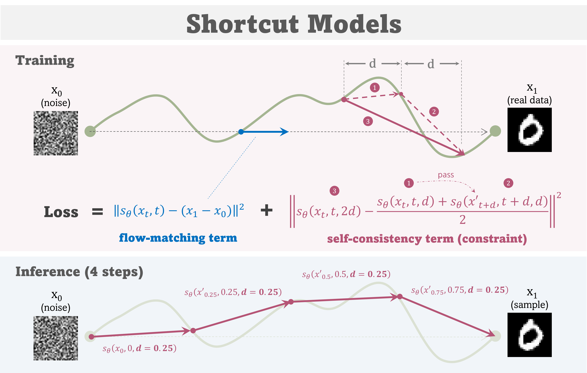
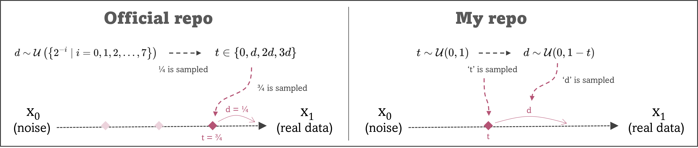
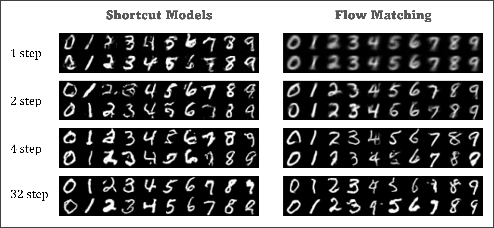
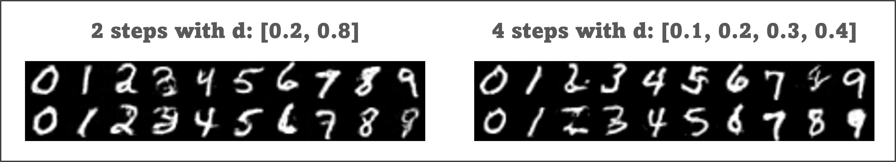

# ⏭️ Shortcut Models | One Step Diffusion via Shortcut Models

This is an unofficial PyTorch tutorial code of **`Shorcut Models`**[1]
which is training/sampling framework aiming for efficient and high-performance
diffusion/flow-matching models especially with few sampling steps.



This repository supports:
- 🔥 Clear implementation of `Shortcut Models` with PyTorch.
- 🔥 Simple and scalable DiT model support.
- 🔥 Distributed training with multiple GPUs / multiple Nodes.

The official JAX-based codebase can be found in the following repository.
- Code : https://github.com/kvfrans/shortcut-models
- Paper : https://arxiv.org/abs/2410.12557

** [NOTE] Please note that an implementation of models and conditioning in this repository
differs from the official repository.

## Implementation difference from the official repo

While the paper and the official repo's implementation is specialized for a specific number of sampling steps (1, 4, 8, 32, 64 and 128), this repository provides a more generalized implementation to support flexible sampling as shown in the figure below.



## Typo in the paper?

In the paper, the target term of the self-consistency objective is formulated with the following equation (eq.4 and eq.5).
```math
s(x_t, t, d)/2 + s(x'_{t + d}, t, d)/2
```

However, based on the definition of shortcut models, the value of 
't' in the second term should also be updated, and this is likely a typo in the following equation.
```math
s(x_t, t, d)/2 + s(x'_{t + d}, t+d, d)/2
```

# Requirements

- Python 3.8.10 or later
- PyTorch 2.1 or later

## Building a training environment

To simplify setting up the training environment, I recommend to use container systems like `Docker` or `Singularity` instead of installing dependencies on each GPU machine. Below are the steps for creating `Singularity` containers. 

All example scripts are stored at the [container](container/) folder.

### 1. Install Singularity

Install the latest Singularity by following the official instruction.
- https://docs.sylabs.io/guides/main/user-guide/quick_start.html#quick-installation-steps

### 2. Create a Singularity image file

Create (build) a Singularity image file with a definition file.
```bash
singularity build --fakeroot shortcut.sif shortcut.def
```

** NOTE: You might need to change NVIDIA base image in the definition file to match your GPU machine.

Now, you obtained a container file for training and inference of Shortcut Models.

## Setting a WandB account for logging

The training code also requires a Weights & Biases account to log the training outputs and demos. 
Please create an account and follow the instruction.

Once you create your WandB account,
you can obtain the API key from https://wandb.ai/authorize after logging in to your account.
And then, the API key can be passed as an environment variable `WANDB_API_KEY` to a training job
for logging training information.

```bash
$ WANDB_API_KEY="12345x6789y..."
```

## Training from scratch

In this repository, all the training parameters are configured by `Hydra`,
allowing them to be set as command-line arguments.

The following is an example of a job script for training using the LibriTTS dataset.
```bash
ROOT_DIR="/path/to/this/repository/"
CONTAINER_PATH="/path/to/shortcut.sif"

WANDB_API_KEY="12345x6789y..."
PORT=12345
JOB_ID="job_name"
OUTPUT_DIR=${ROOT_DIR}/output/${MODEL}/${JOB_ID}/
DATASET_DIR=${ROOT_DIR}/output/dataset/  # MNIST dataset is loaded into this directory.

MODEL="shortcut-dit"
BS=128  # This must be a multiple of GPU number. Please adjust to your environment.
NUM_WORKERS=8

mkdir -p ${OUTPUT_DIR}
mkdir -p ${DATASET_DIR}

# Execution
singularity exec --nv --pwd $ROOT_DIR -B $ROOT_DIR  \
    --env MASTER_PORT=${PORT} --env WANDB_API_KEY=$WANDB_API_KEY \
    ${CONTAINER_PATH} \
torchrun --nproc_per_node gpu ${ROOT_DIR}/src/train.py \
    model=${MODEL} \
    trainer.output_dir=${OUTPUT_DIR} \
    trainer.dataset_dir=${DATASET_DIR} \
    trainer.batch_size=${BS} \
    trainer.num_workers=${NUM_WORKERS} \
    trainer.logger.project_name=${MODEL} \
    trainer.logger.run_name=job-${JOB_ID}
```

## Resume training from a checkpoint

While training, checkpoints (state_dict) of models, optimizers and schedulers are saved under the output directory specified in the configuration as follows.
```
output_dir/
├─ ckpt/
│  ├─ latest/
│  │  ├─ optimizer.pth
│  │  ├─ scheduler.pth
│  │  ├─ model.pth
│  │  ├─ ...
```

By specifying the checkpoint directory, you can easily resume your training from the checkpoint.
```bash
CKPT_DIR="output_dir/ckpt/latest/"

# Execution
singularity exec --nv --pwd $ROOT_DIR -B $ROOT_DIR -B $CKPT_DIR \
    --env MASTER_PORT=${PORT} --env WANDB_API_KEY=$WANDB_API_KEY \
    ${CONTAINER_PATH} \
torchrun --nproc_per_node gpu ${ROOT_DIR}/src/train.py \
    trainer.ckpt_dir=${CKPT_DIR}
```

# Inference

The [`inference.py`](src/inference.py) is a sample code for generating MNIST images
from a pretrained checkpoint.

```bash
CKPT_DIR="output_dir/ckpt/latest/"
OUTPUT_DIR="output_dir/sample/"

STEP=4  # number of sampling steps
NUM_PER_LABEL=2

singularity exec --nv --pwd $ROOT_DIR -B $ROOT_DIR \
    --env MASTER_PORT=${PORT} \
    ${CONTAINER_PATH} \
torchrun --nproc_per_node gpu --master_port ${PORT} \
${ROOT_DIR}/src/inference.py \
    --ckpt-dir ${CKPT_DIR} \
    --output-dir ${OUTPUT_DIR} \
    --step ${STEP} \
    --num-per-label ${NUM_PER_LABEL}
```

# Samples (MNIST)

**[NOTE]** These samples just shows `tendency` of difference between shortcut models and naive flow matching models. The model was not trained for enough long iterations and the architecture might not be appropriate for the dataset.

### Shortcut Models vs. Flow Matching



### Irregular step sampling via Shortcut Models

Thanks to the  [flexible sampling of `t` and `d`](#implementation-difference-from-the-official-repo) in this repository, it is also possible to perform sampling with irregular step sizes.



# References

1. "One Step Diffusion via Shortcut Models", K. Frans et al., ICLR, 2025